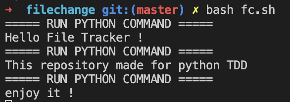

# File Change Tracker for Python

## Environment
OS -> Mac M1

CLI -> ZSH

## Overview
- this repository use shell script(.sh) for `Python TDD`
- you can change `line 8, 9` if you want
```sh
echo "===== RUN PYTHON COMMAND =====" # just printing when it is triggered
python3 test.py # command you want to execute
```
- also, you can make `.ignore` ignore folder or file in directory
  * I tried to make it work like gitignore but I think algorithm is not good as the files, folders increase

## How to use
- in zsh
```zsh
bash fc.sh
```



## check_ignore.py & .ignore
- if you want to ignore folder, the name ends with '/' or '/*'
- or not, assuming it file as default
- check_ignore.py check folder patterns first
- and, it exclude file if the file matches with file patterns
